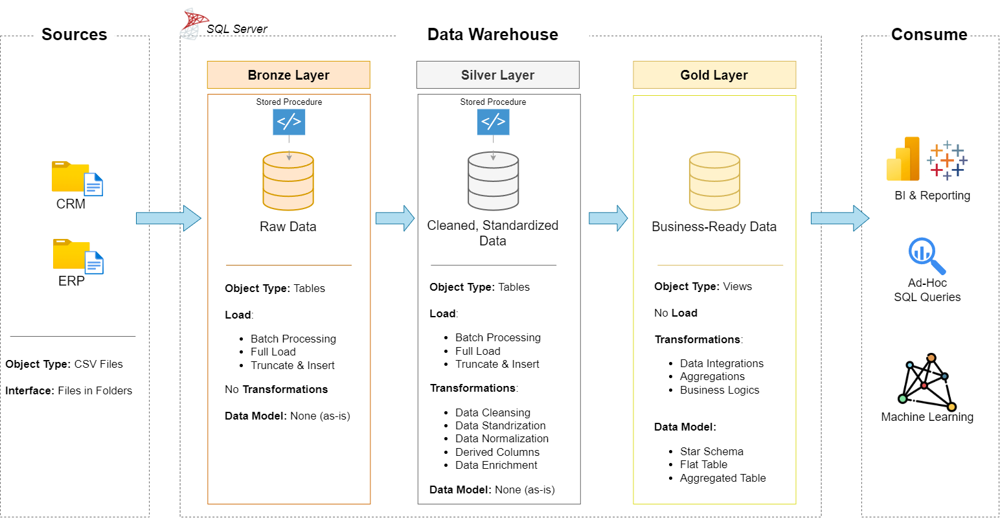
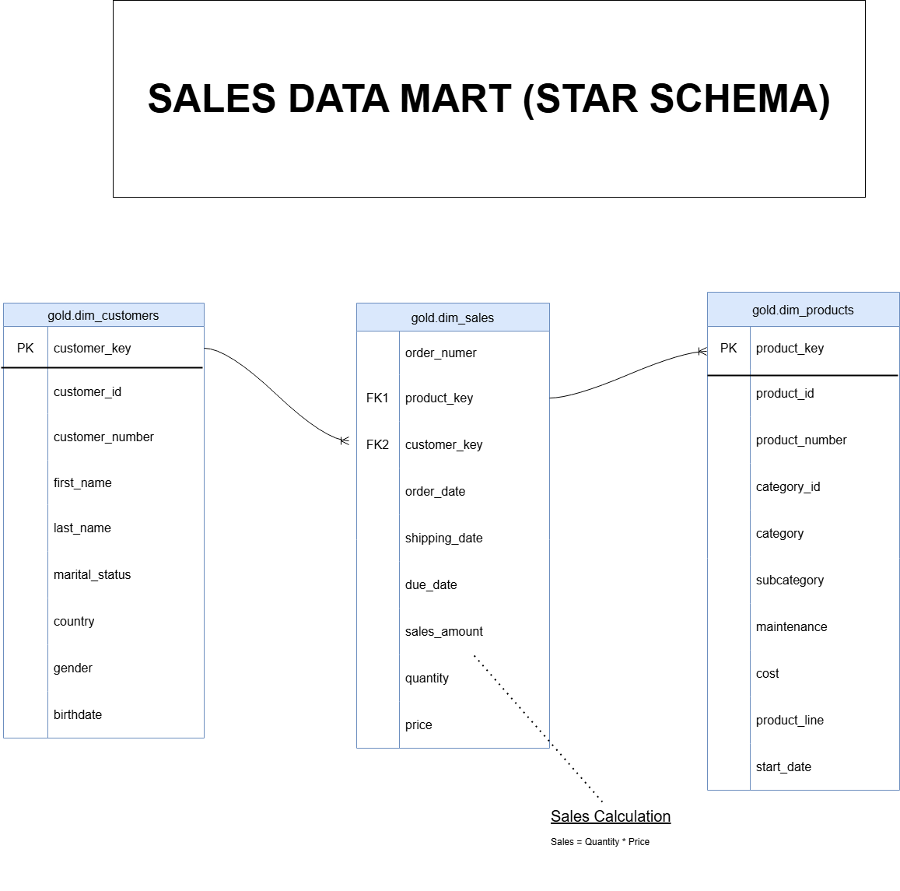

# Data Warehouse and Analytics Project
Welcome to the Data Warehouse and Analytics Project repository! 🚀
This project demonstrates a comprehensive data warehousing and analytics solution, from building a data warehouse to generating actionable insights. 

# Data Architecture
The data architecture for this project follows Medallion Architecture Bronze, Silver, and Gold layers:

1. Bronze Layer: Stores raw data as-is from the source systems. Data is ingested from CSV Files into SQL Server Database.
2. Silver Layer: This layer includes data cleansing, standardization, and normalization processes to prepare data for analysis.
3. Gold Layer: Houses business-ready data modeled into a star schema required for reporting and analytics.

# Project Overview 
This project involves:
* Data Architecture: Designing a Modern Data Warehouse Using Medallion Architecture Bronze, Silver, and Gold layers.
  
* ETL Pipelines: Extracting, transforming, and loading data from source systems into the warehouse.
  
* Data Modeling: Developing fact and dimension tables optimized for analytical queries.
  
* Analytics & Reporting: Creating SQL-based reports and dashboards for actionable insights.

# Project Requirements

## Building the Data Warehouse 
Objective
Develop a modern data warehouse using SQL Server to consolidate sales data, enabling analytical reporting and informed decision-making.

Specifications
* Data Sources: Import data from two source systems (ERP and CRM) provided as CSV files.
* Data Quality: Cleanse and resolve data quality issues prior to analysis.
* Integration: Combine both sources into a single, user-friendly data model designed for analytical queries.
* Scope: Focus on the latest dataset only; historization of data is not required.
* Documentation: Provide clear documentation of the data model to support both business stakeholders and analytics teams.

#  Business Intelligence (BI): Analytics & Reporting

Objective:
Develop SQL-based analytics to provide detailed insights and actionable business metrics.

Focus Areas:

Customer Behavior: Understand customer patterns, preferences, and purchasing trends.

Product Performance: Track the success of various products based on sales data.

Sales Trends: Analyze sales trends over time to uncover key insights.

These insights will help stakeholders make data-driven decisions and support business growth strategies.

# Tools & Technologies Used
SQL Server: For building and managing the data warehouse.

ETL (Extract, Transform, Load): Tools/methods used for data cleansing and integration.

SQL: For querying and generating reports from the data warehouse.

# License 
This project is licensed under the MIT License. You are free to use, modify, and share this project with proper attribution.
